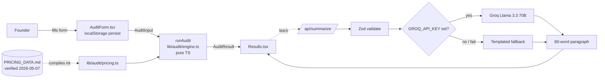

# Architecture

## One-line summary

A static Next.js page calls a pure-TypeScript audit engine in the browser,
then asks a server route for an LLM-written summary on top of the result.
That's it. No database in the critical path.

## Diagram

## Why this shape

**The audit is deterministic, not AI.** A 2-person team on Claude Team is
overpaying $110/mo whether or not an LLM agrees. Putting the LLM inside the
audit math would be both slower and less defensible — a Credex reviewer
couldn't verify the number without re-running a prompt. So the math is pure
TypeScript with named rule functions, and tests pin the headline cases.

**The LLM writes the narrative, not the numbers.** It gets the deterministic
result as JSON and turns it into one paragraph. If it fails, a templated
paragraph runs. The savings number on screen never depends on an API.

**Form state in localStorage, not the URL or DB.** Founders bail and come back.
Re-entering 6 tools is friction. localStorage covers the 95% case; the
shareable URL (Day 3) will use a server-side slug for the result, not the
input.

## Data flow on submit

1. `AuditForm.tsx` builds `AuditInput` and calls `onSubmit`.
2. `app/page.tsx` calls `runAudit(input)` synchronously — result renders immediately.
3. In parallel, it `POST`s to `/api/summarize` with `{ input, result }`.
4. Route validates with Zod, calls Groq if key is present, falls back to a
   templated paragraph on missing key, network error, or empty completion.
5. Summary appears in the Results panel when it lands. Failure mode is silent.

## Files that matter

- `lib/audit/pricing.ts` — every plan price. Touch this when pricing changes.
- `lib/audit/engine.ts` — every rule, one function each, all pure.
- `lib/audit/engine.test.ts` — locks in the rules with named scenarios.
- `app/api/summarize/route.ts` — the only server-side surface.

## Planned (Day 2–7)

- Lead capture → Supabase + Resend transactional email (Day 3).
- Shareable result URL: `/audit/[slug]` with server-side render + OG/Twitter tags (Day 3).
- Rate limit + honeypot on `/api/summarize` and lead capture (Day 4).
- GitHub Actions: lint + test on push to main (Day 5).
- Lighthouse pass: Perf ≥85, A11y ≥90, BP ≥90 (Day 6).
